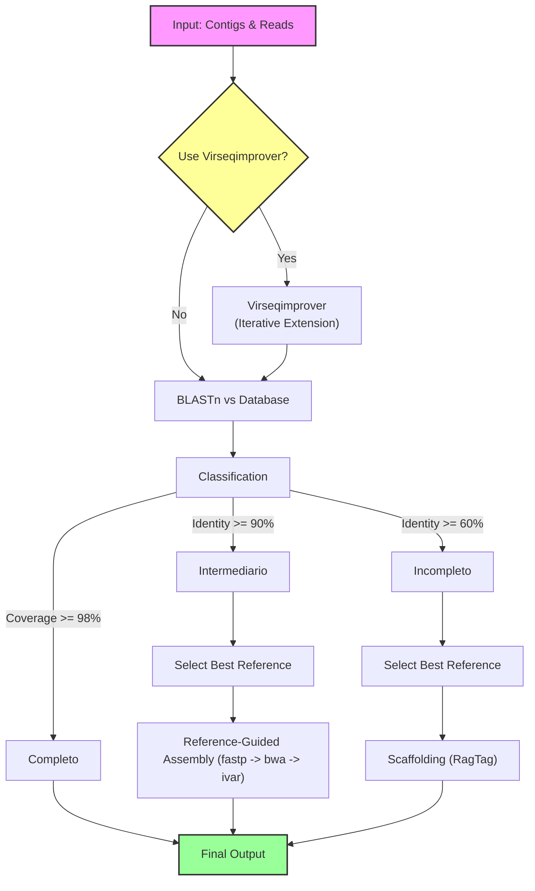

# Virasca

Virasca (**Vir**us **Sca**ffolding) is a CLI tool for scaffolding/genome assembly of viral contigs, using Snakemake for workflow management.

## Installation

It is recommended to use `micromamba` (or `conda`/`mamba`) to manage dependencies.

1. **Clone virasca repository and submodules**:
   ```bash
   git clone https://github.com/WallauBioinfo/virasca.git
   cd virasca
   ```

2. **Create the environment**:
   ```bash
   micromamba env create -f environment.yml
   ```

3. **Activate the environment**:
   ```bash
   micromamba activate virasca
   ```

## Usage

### Configure Database

This command downloads and configures the necessary databases (NCBI Virus genomes and taxonomy).

```bash
virasca configure-database
```

Options:
- `--cores`: Number of cores to use (default: 1).
- `--dry-run`: Print the workflow without executing.

### Run Analysis

This command runs the viral assembly and identification pipeline.

```bash
virasca run --input <scaffolds.fasta> --reads-r1 <R1.fastq.gz> --reads-r2 <R2.fastq.gz>
```

Arguments:
- `--input`: Input FASTA file with contigs/scaffolds.
- `--reads-r1`: Path to R1 reads (FASTQ).
- `--reads-r2`: Path to R2 reads (FASTQ).

Options:
- `--database-seq`: Path to blast database FASTA (required).
- `--database-metadata`: Path to blast database metadata file (required).
- `--output`: Output directory for analysis results (required).
- `--use-virseqimprover`: Enable Virseqimprover step for iterative assembly improvement.
- `--tax-level`: Taxonomic level for reference selection (default: species). Choices: phylum, class, order, family, genus, species.
- `--fastp-threads`: Number of threads for fastp (default: 4).
- `--bwa-threads`: Number of threads for BWA (default: 4).
- `--min-len`: Minimum read length for fastp (default: 50).
- `--trim-len`: Trim length for fastp (default: 0).
- `--mapping-quality`: Minimum mapping quality for iVar consensus (default: 20).
- `--cores`: Number of cores for Snakemake (default: 4).
- `--dry-run`: Print the workflow without executing.

## Testing

To verify the installation and workflow structure (dry-run):

```bash
# Ensure you are in the virasca environment
micromamba activate virasca

# Run the test script
python3 tests/test_cli.py
```

## Workflow Logic



### Configure Database
1.  **Download:** Downloads RefSeq viral genomes using NCBI Datasets CLI.
2.  **Taxonomy:** Downloads and configures NCBI taxonomy dump using TaxonKit.
3.  **Metadata:** Processes metadata to link genomic accessions with full taxonomic lineage (Phylum to Species).
4.  **Database:** Creates a local BLAST nucleotide database.

### Run Analysis
1.  **Preprocessing (Optional):** If `--use-virseqimprover` is set, runs Virseqimprover to iteratively extend input contigs using the provided reads.
2.  **Identification:**
    *   Aligns contigs against the local viral database using BLASTn.
    *   Classifies each hit based on Identity (`pident`) and Coverage (`scov`):
        *   **Completo:** Coverage >= 98%
        *   **Intermediario:** Identity >= 90% (and not complete)
        *   **Incompleto:** Identity >= 60% (and not intermediate)
3.  **Refinement Strategy:**
    *   **For "Intermediario" Genomes:** Selects the best reference (highest bitscore) per taxonomic group. Performs reference-guided assembly:
        *   Read cleaning (fastp)
        *   Mapping (BWA MEM)
        *   Consensus generation (iVar)
    *   **For "Incompleto" Genomes:** Selects the best reference per taxonomic group. Performs scaffolding:
        *   Scaffolds input contigs against the reference using RagTag.
4.  **Output:** Generates a final summary report linking original contigs, classification status, and refinement results.
